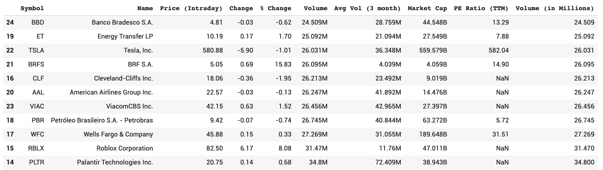

# Adewole

[Projects](https://google.com) | [Resume](https://google.com) | [About Me](https://google.com)

## Latest Projects

### [Python for Data Science](https://colab.research.google.com/gist/wolejnr/cb25c012a6ea72df67e81ea11d27c440/week1_python-for-data-science.ipynb)
This is a crash course introduction to Python for Data Science

### [Indeed Scraper](https://colab.research.google.com/gist/wolejnr/16320e460b13182ce9b7759051fb6a17/week1_assignment_indeed-scraper.ipynb)
This project is targeted at aspiring job applicants. It allows a job seeker enter a search criteria and it returns a list of recently posted jobs
on Indeed to the user.
* **Python** was the undelying language used in creating this tool
* **Requests** was the Python library used to retrieve information from the Indeed page
* **Pandas** library was used for storing and manipulating the table data retrieved

### [Determining Viable Stocks](https://colab.research.google.com/gist/wolejnr/85e6d2d02bcd0e2a8ead5eabc06e024f/week2_data-science-foundations.ipynb)
This project was developed TerraComp Ltd. It allows them to identify active stock for investment purposes.
* **Python** was the undelying language used in creating this tool
* **Requests** was the Python library used to retrieve information from the Indeed page
* **Pandas** library was used for storing and manipulating the table data retrieved

### [Visualizing Active Stocks](https://colab.research.google.com/drive/1ZcXyZ4R63uyqHsfbnE8VCtlHS9nPji92)
This project is a follow up to the project on determining viable stocks. It gives a visual picture of all the active and viable stocks in the market.
It helps the Board of TerraComp Ltd. to decide where to invest.
* **Python** was the undelying language used in creating this tool
* **Requests** was the Python library used to retrieve information from the Indeed page
* **Pandas** library was used for storing and manipulating the table data retrieved

